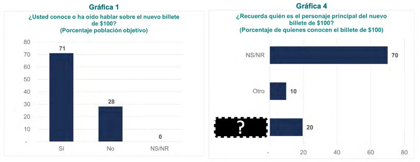
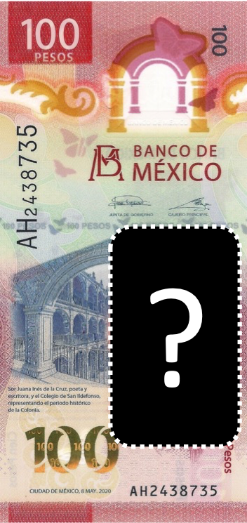
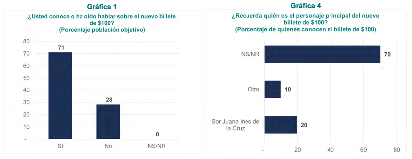
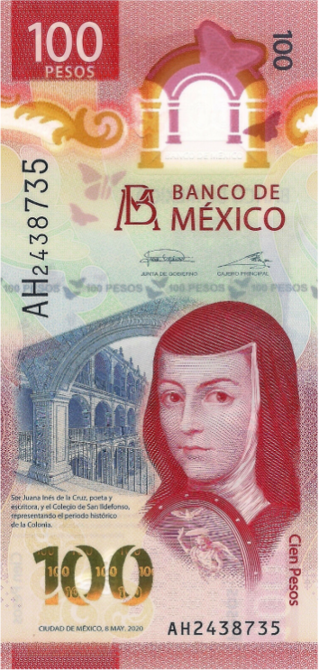

```{r setup, include=FALSE}
knitr::opts_chunk$set(echo = TRUE, comment = NA)
```

<style>
div.footnotes {
  position: absolute;
  bottom: 5px;
  margin-left: 50px;
  margin-bottom: 10px;
  width: 80%;
  font-size: 0.6em;
}
</style>

<script src="https://ajax.googleapis.com/ajax/libs/jquery/3.1.1/jquery.min.js"></script>
<script>
$(document).ready(function() {
  $('slide:not(.backdrop):not(.title-slide)').append('<div class=\"footnotes\">');

  $('footnote').each(function(index) {
    var text  = $(this).html();
    var fnNum = (index+1).toString();
    $(this).html(fnNum.sup());

    var footnote   = fnNum + '. ' + text + '<br/>';
    var oldContent = $(this).parents('slide').children('div.footnotes').html();
    var newContent = oldContent + footnote;
    $(this).parents('slide').children('div.footnotes').html(newContent);
  });
});
</script>


## Antes de iniciar

<font size="100">El contenido de esta presentación, así como las conclusiones que de ésta se derivan, **son responsabilidad exclusiva del autor** y no reflejan necesariamente las del Banco de México.</font>

## Introducción
Principales **áreas de trabajo** de un actuario.

```{r echo=FALSE, areas, fig.align = 'center', out.width = "80%"}
knitr::include_graphics(here::here("images", "03_areas.png"))
```


## Introducción

```{r echo=FALSE, banxico, fig.align = 'center', out.width = "30%"}
knitr::include_graphics(here::here("images", "04_banxico.png"))
```

- Banco de México ≡ **Banco Central**
- Finalidad: **proveer** a la economía del país de **moneda nacional**.
- En el **área de Emisión** se realizan **estudios cualitativos y cuantitativos** sobre el **dinero en efectivo**
   - Conocer la **opinión** de las personas
   - Actualmente estudios **publicados de 2011 a 2021**

## Estudios

<div class="columns-2">

### **Cuantitativos**

- Encuestas
- Mystery Shopper
- Inspecciones a la banca
- Vida media de los billetes
- Métrica-D


### **Cualitativos**

- Grupos focales
- Diario de Pagos
- Estudios con personas ciegas
- Neurociencia
</div>

# Encuestas
Estudios cuantitativos periódicos

## Encuestas

- 4 **trimestrales** (indicadores)  y  1 **anual** (coyuntura)

<div class="columns-2">
- Aspectos metodológicos:
   - Aprox. **2,100 encuestas** 
   - Localidades ≥ **50 mil habitantes**
   - Edad **18-79** años
   - Entrevista cara a cara
   - **Estratificado por región**
   - Selección aleatoria por AGEB, manzana, cuadra, vivienda, hogar y persona

```{r echo=FALSE, mapa_01, fig.align = 'center', out.width = "100%"}
knitr::include_graphics(here::here("images", "07_mapa.png"))
```
</div>

## Encuestas trimestrales
- **Temas fijos**
   - ⭐ **<span style="color:black">Usos y hábitos</span>** ⭐
   - Cajeros, ventanillas y otros
   - Servicio que ofrecen los bancos
   - ⭐ **<span style="color:black">Elementos de seguridad</span>** ⭐️
   - ⭐ **<span style="color:black">Estado físico de los billetes y monedas</span>** ⭐️
<br>  
- **Temas temporales**
   - Medios de pago usados durante la pandemia
   - Desinfección de billetes
   - Evaluación de personajes
   - Billete $500 G

## Encuestas trimestrales
**¿Qué formas de pago acostumbras usar para hacer tus gastos diarios?**<footnote>Porcentaje de la población. Respuesta múltiple, no suma 100%. Resultados de encuesta trimestral 2021 T4.</footnote>

```{r echo=FALSE, gastos_diarios, fig.align = 'center', out.width = "75%"}
knitr::include_graphics(here::here("images", "09_gastos.png"))
```

## Encuestas trimestrales – actividad

__*"En los billetes… ¿qué elementos de seguridad recuerdas?"*__

```{r echo=FALSE, qr_01, fig.align = 'center', out.width = "90%"}
knitr::include_graphics(here::here("images", "10_cel_y_qr.png"))
```


## Encuestas trimestrales – actividad

```{r echo=FALSE, respuestas_01, fig.align = 'center', out.width = "95%"}
knitr::include_graphics(here::here("images", "11_Respuestas_01.png"))
```

## Encuestas trimestrales

¿Qué **elementos de seguridad** reconoces o recuerdas?<footnote>Porcentaje de la población que mencionó al menos un elemento de seguridad. Respuesta múltiple, no suma 100%. Resultados de encuesta trim. 2021 T4.</footnote>

<div class="columns-2">
```{r echo=FALSE, elementos_a, fig.align = 'center', out.width = "100%"}
knitr::include_graphics(here::here("images", "12_elementos_a.png"))
```

```{r echo=FALSE, elementos_b, fig.align = 'center', out.width = "105%"}
knitr::include_graphics(here::here("images", "12_elementos_b.png"))
```
</div>

## Encuestas trimestrales

Índice de **percepción de la calidad del billete** en circulación.<footnote>Escala entre 0 y 10, donde 0 significa que los billetes se perciben muy deteriorados y 10 que se perciben como nuevos. Original del programa de trabajo 2021-0222 del Banco de México.</footnote>

```{r echo=FALSE, calidad, fig.align = 'center', out.width = "80%"}
knitr::include_graphics(here::here("images", "13_calidad.png"))
```

## Encuestas trimestrales

Indicadores **publicados** en el **SIE**.<footnote>Sistema de Información Económica (SIE) del Banco de México.<br>⚠️ Nota:  Para quienes programan en {width=3%} se pueden conectar al SIE a través de SIE API usando el paquete `siebanxicor`.</footnote>

- **Billete**
   - <span style="background-color:yellow">Índice de percepción de la calidad del billete en circulación</span>
      - *20, 50, 100, 200, 500 y 1000 pesos, general*
   - Porcentaje de personas que recuerdan 2 o más elementos de seguridad
   - Porcentaje de personas que revisan la autenticidad de sus billetes
- **Cambio**
   - Porcentaje de personas que en la última compra no recibieron su cambio completo
   - Porcentaje de personas que no realizaron una compra por falta de cambio

## Encuesta anual

- ⭐ **<span style="color:black">Nuevo billete de $100</span>** ⭐️

- Nuevos billetes de $1000

- Medios de pago usados durante la pandemia

- App BilletesMx

- ⭐ **<span style="color:black">Preferencia entre el billete y la moneda de $20</span>** ⭐️

- Evaluación general de los Bocetos

- Familia actual de billetes

- Preferencia en color de billetes

## Encuesta anual – actividad

__*"¿Recuerdas quién es el personaje principal del nuevo billete de $100?"*__


```{r echo=FALSE, qr_02, fig.align = 'center', out.width = "90%"}
knitr::include_graphics(here::here("images", "16_cel_y_qr.png"))
```

## Encuesta anual – actividad

```{r echo=FALSE, respuestas_02, fig.align = 'center', out.width = "95%"}
knitr::include_graphics(here::here("images", "17_Respuestas_02.png"))
```

## Encuesta anual

Nuevo **billete** de **$100**.<footnote>Resultados de encuesta anual 2021.</footnote>

<div class="columns-2">

- **71 % conoce** el billete
- Sólo el **20 %** de quienes lo conocen, **saben** que el personaje es...

<center>{width=100%}</center>

<center>{width=45%}</center>
</div>

## Encuesta anual

Nuevo **billete** de **$100**.<footnote>Resultados de encuesta anual 2021.</footnote>

<div class="columns-2">

- **71 % conoce** el billete
- Sólo el **20 %** de quienes lo conocen, **saben** que el personaje es...

<center>{width=100%}</center>

<center>{width=45%}</center>
</div>

## Encuesta anual

Preferencia entre **billete y moneda de $20**.

```{r echo=FALSE, ByM_20_a, fig.align = 'left', out.width = "90%"}
knitr::include_graphics(here::here("images", "20_ByM_20_a.png"))
```

## Encuesta anual

Preferencia entre **billete y moneda de $20**.<footnote>Resultados de encuesta anual 2014.</footnote>

```{r echo=FALSE, ByM_20_b, fig.align = 'left', out.width = "90%"}
knitr::include_graphics(here::here("images", "21_ByM_20_b.png"))
```

<div class="columns-2">
<center>
**64 %** población prefiere usar el **billete**,

**25 %** prefiere usar la **moneda**
</center>
</div>
<br>
<center>...**9 %** le es indiferente y **2 %** no contestó.</center>

# Grupos focales
Estudios cualitativos periódicos

## Grupos focales

- 2 rondas anuales

<div class="columns-2">
- Aspectos metodológicos:
   - Grupos reducidos **10 participantes**
   - Alcance: CDMX y 6 ciudades grandes o medianas<footnote>Se ilustra en el mapa la distribución de la 2a ronda de grupos focales 2021.</footnote>
   - Edad **18-60 años**
   - Niveles socioeconómicos: nivel **ABC+**, **C-/D+**, **usuarios intensivos** (o personas ciegas)

```{r echo=FALSE, mapa_02, fig.align = 'center', out.width = "100%"}
knitr::include_graphics(here::here("images", "23_mapa.png"))
```

</div>

## Grupos focales
- ⭐ **<span style="color:black">Moneda de 50 centavos</span>** ⭐️
- Campañas de comunicación
- ⭐ **<span style="color:black">Billete de $100</span>** ⭐️
- Recordación de características principales de los billetes
- Identificación de billetes falsos
- ⭐ **<span style="color:black">Diversas propuestas para el diseño billetes</span>** ⭐️
- ⭐ **<span style="color:black">Características para un nuevo cono</span>** ⭐️
- Medios de pago


## Grupos focales

Participantes que utilizan las **monedas de 50¢** actual y anterior (dorada).<footnote>Resultados por ciudad de 2a ronda de grupos focales 2021.</footnote>

```{r echo=FALSE, centavos_50, fig.align = 'center', out.width = "55%"}
knitr::include_graphics(here::here("images", "25_50cent.png"))
```

## Grupos focales

Elemento **más fácil de revisar** en el nuevo billete de **$100**.<footnote>Resultados por tipo de grupo de 2a ronda de grupos focales 2020. Respuesta múltiple, no suma 100%.<br>Base: 210 participantes = 70 de los niveles ABC+, 70 de los niveles C-/D+ y 70 usuarios intensivos de efectivo.</footnote>

```{r echo=FALSE, elementos_seg, fig.align = 'center', out.width = "70%"}
knitr::include_graphics(here::here("images", "26_elementos.png"))
```

## Grupos focales

Opinión sobre **serpiente** en nuevos diseños de billetes.<footnote>El *word cloud* es parte de los resultados de la 2a ronda de grupos focales 2018. Porcentajes de acuerdo a la 2a ronda de grupos focales 2014.</footnote>

<div class="columns-2">

```{r echo=FALSE, serpiente, fig.align = 'center', out.width = "85%"}
knitr::include_graphics(here::here("images", "27_serpiente.png"))
```

```{r echo=FALSE, wordcloud, fig.align = 'center', out.width = "85%"}
knitr::include_graphics(here::here("images", "27_wordcloud.png"))
```
</div>
<br>
Diseño con serpiente: ☹️ del 59%  y  22% le asusta.

## Grupos focales

Propuestas para **diseños de monedas.**<footnote>Resultados de 1a ronda de grupos focales 2014.</footnote>

```{r echo=FALSE, monedas, fig.align = 'center', out.width = "75%"}
knitr::include_graphics(here::here("images", "28_MONEDAS.png"))
```

# Diario de pagos
Estudios cualitativos periódicos

## Diario de pagos

- Se seleccionan **participantes de grupos focales**.

- Apuntan durante **2 semanas**:
   - **Artículos** comprados
   - Lugar y monto de **transacción**
   - **Medio** de pago
   - **Billetes y monedas** pagadas y recibidas

- No son estadísticamente representativos.
- Identificar **tendencias o cambios** en el uso de efectivo.

## Diario de pagos
Comentarios<footnote>Comentarios de mi autoría basados en resultados de grupos focales.</footnote> de grupos focales relacionados con los diarios:

- **Monedas de 10 y 20 centavos.**  

   > *"Nadie las acepta y no alcanzan para nada"*

- **Pagos y cambio.**  

   > *"En tiendas no me aceptan billetes de 500 ni de 1000"*

- **Redondeo.**  

   > *"Te redondean y luego no sabes ni para quién es"*
   
# Estudios con personas ciegas
Estudios cualitativos especiales

## Estudios con personas ciegas

- ⭐ **<span style="color:black">Selección de marcas hápticas</span>** ⭐️

- ⭐ **<span style="color:black">Tablilla para denominar billetes</span>** ⭐️

- Relieve en ventana transparente de los billetes

- Moneda de 50 centavos


## Estudios con personas ciegas

Selección de **marcas hápticas**.<footnote>Estudios realizados en 2016.</footnote>

<div class="columns-2">
```{r echo=FALSE, marcas_internacionales, fig.align = 'center', out.width = "82%"}
knitr::include_graphics(here::here("images", "34_marcas_int.png"))
```

<div class="rows-2">
```{r echo=FALSE, diagrama, fig.align = 'center', out.width = "80%"}
knitr::include_graphics(here::here("images", "34_diagrama.png"))
```

```{r echo=FALSE, marcas_mexico, fig.align = 'center', out.width = "45%"}
knitr::include_graphics(here::here("images", "34_marcas_mex.png"))
```
</div>
</div>

## Estudios con personas ciegas

**Tablilla** para denominar billetes.<footnote>Estudio realizados en 2017.</footnote>

<div class="columns-2">
<div class="columns-2">
```{r echo=FALSE, billetes_size, fig.align = 'left', out.width = "80%"}
knitr::include_graphics(here::here("images", "35_size.png"))
```

```{r echo=FALSE, manos, fig.align = 'right', out.width = "115%"}
knitr::include_graphics(here::here("images", "35_manos.png"))
```
</div>


```{r echo=FALSE, plot_tablilla, fig.align = 'left', out.width = "120%"}
knitr::include_graphics(here::here("images", "35_plot.png"))
```


```{r echo=FALSE, tablilla, fig.align = 'right', out.width = "80%"}
knitr::include_graphics(here::here("images", "35_tablilla.png"))
```
</div>

# Mystery shopper
Estudios cuantitativos especiales

## Mystery shopper<footnote>Información de acuerdo convocatoria de licitación pública nacional No.BM-SACRH-224-13-1.</footnote>
<div class="columns-2">
```{r echo=FALSE, atm_1, fig.align = 'center', out.width = "60%"}
knitr::include_graphics(here::here("images", "37_atm.png"))
```

```{r echo=FALSE, mercado, fig.align = 'right', out.width = "80%"}
knitr::include_graphics(here::here("images", "37_mercado.png"))
```
</div>
<br>

- **Extracción** de billetes en circulación.
   - **Comercios – ATM – Ventanilla**


# Inspecciones a la banca
Estudios cuantitativos periódicos

## Inspecciones a la banca<footnote>Información de acuerdo al Programa de trabajo 2021-2022 del Banco de México.</footnote>

```{r echo=FALSE, dos_fotos, fig.align = 'center', out.width = "90%"}
knitr::include_graphics(here::here("images", "39_fotos.png"))
```

- Cumplimiento al **servicio de canje** en sucursales bancarias.
- **Calidad de los billetes** entregados en sucursales y ATM.
- Tratamiento de **piezas presuntamente falsas**.


## Inspecciones a la banca
<div class="columns-2">

- **Calidad** del billete entregado

```{r echo=FALSE, calidad_ok, fig.align = 'right', out.width = "84%"}
knitr::include_graphics(here::here("images", "40_calidad_ok.png"))
```

```{r echo=FALSE, calidad_mal, fig.align = 'right', out.width = "85%"}
knitr::include_graphics(here::here("images", "40_calidad_mal.png"))
```

<br>

- **Canje** de billetes y monedas
```{r echo=FALSE, deteriorado, fig.align = 'center', out.width = "60%"}
knitr::include_graphics(here::here("images", "40_deteriorado.png"))
```

```{r echo=FALSE, desmonetizado, fig.align = 'center', out.width = "60%"}
knitr::include_graphics(here::here("images", "40_desmonetizado.png"))
```

```{r echo=FALSE, canje_02, fig.align = 'center', out.width = "60%"}
knitr::include_graphics(here::here("images", "40_canje.png"))
```

</div>

# Vida media de los billetes
Estudios cuantitativos periódicos

## Vida media de los billetes

- El **tiempo de vida** de un billete se mide **desde que sale a circulación hasta que es retirado** por desgaste o falla mecánica.
- Para el cálculo de vida se utiliza una **función de supervivencia**.

<center>Duración promedio del billete<footnote>Gráfica con base en información publicada en el SIE: Duración promedio del billete (CM4).</footnote></center>

```{r echo=FALSE, duracion, fig.align = 'center', out.width = "55%"}
knitr::include_graphics(here::here("images", "42_duracion.png"))
```

# Métrica-D
Estudios cuantitativos especiales

## Métrica-D

Análisis de **estructura de denominaciones** de un país.<footnote>Información de documento “Consideraciones sobre las denominaciones de billetes en México”.</footnote>

- **Objetivo**
   - Optimizar producción y distribución del efectivo
   - Eficiencia en transacciones
   - Revisión de denominaciones
   
- **Métrica ‘D’**
   - ‘D’ es el salario promedio ≈ 256 pesos.<footnote>Salario diario promedio del 1r trimestre 2020 Datos de la Encuesta Nacional de Ocupación y Empleo (ENOE).</footnote>
   - **6** denominaciones para **moneda** y **6** para **billete**
   
- **México**
   - **9** denominaciones para **moneda** y **6** para **billete**

## Métrica-D

**Estructura de denominaciones** en México.

```{r echo=FALSE, metrica, fig.align = 'center', out.width = "80%"}
knitr::include_graphics(here::here("images", "45_metrica.png"))
```

# Neurociencia
Estudios cualitativos especiales

## Neurociencia
- Evaluar **percepción táctil y visual** sobre el efectivo.

- Uso de técnicas que integran Neurociencia<footnote>Técnica científica que estudia el sistema nervioso del ser humano para trata de descifrar cómo opera el cerebro.</footnote>, Antropología, Psicología, Estadística y Tecnología
   - Laboratorio
   - Entrevistas
   - Encuestas en la calle


## Neurociencia
- Zonas del billete que **captan la atención**.<footnote>Estudio de Neurociencias de 2014 sobre los elementos de seguridad en los billetes.
</footnote>

```{r echo=FALSE, zonas_billetes, fig.align = 'center', out.width = "80%"}
knitr::include_graphics(here::here("images", "48_billetes.png"))
```

<div class="columns-2">
<br>
<br>

- Mapa visual de los **elementos más memorables** por cada billete.

<br>
<br>

```{r echo=FALSE, memorables, fig.align = 'center', out.width = "55%"}
knitr::include_graphics(here::here("images", "48_memorables.png"))
```
</div>


## Neurociencia

**Mapas de navegación visual**.<footnote>Estudio de Neurociencias de 2015 sobre la percepción háptica y visual de los billetes.</footnote>

<div class="columns-2">
<br>

**Hallazgos:**

1. Efecto **señalador**
2. **Cercanía** de imágenes
3. Colores que **contrasten**
4. **Números grandes**

<br>
<br>

```{r echo=FALSE, navegacion, fig.align = 'center', out.width = "70%"}
knitr::include_graphics(here::here("images", "49_navegacion.png"))
```
</div>

## Neurociencia

<div class="columns-2">
```{r echo=FALSE, recuerda, fig.align = 'center', out.width = "85%"}
knitr::include_graphics(here::here("images", "50_recuerda.png"))
```

El cerebro prioriza elementos ubicados en una posición ya conocida y familiar.

```{r echo=FALSE, cerebro, fig.align = 'center', out.width = "18%"}
knitr::include_graphics(here::here("images", "50_cerebro.png"))
```

**Hallazgo:**  
No poner otro elemento en el espacio donde la gente ya ubica la leyenda *"BANCO DE MÉXICO"*.

```{r echo=FALSE, marca_200, fig.align = 'center', out.width = "55%"}
knitr::include_graphics(here::here("images", "50_200.png"))
```

</div>

# Comentarios finales

## Comentarios finales

Los **conocimientos y habilidades** de un **actuario** para analizar y resolver problemas lo hacen un profesionista muy **versátil**, que puede desarrollarse en diversas áreas de la industria, gobierno y empresas.

<br>

```{r echo=FALSE, empresas, fig.align = 'center', out.width = "100%"}
knitr::include_graphics(here::here("images", "52_empresas.png"))
```


## Referencias
Página web del {width=22%}: [www.banxico.org.mx](www.banxico.org.mx)

- Sección **Billetes y monedas**
   - [Estudios](https://www.banxico.org.mx/billetes-y-monedas/estudios-e-indicadores/estudios-indicadores.html)
   - [Micrositio de la nueva familia de billetes (familia G)](https://www.banxico.org.mx/billetes-y-monedas/nueva-familia-billetes--famil.html)
   - [Características de billetes y monedas para personas con discapacidad visual](https://www.banxico.org.mx/billetes-y-monedas/caracteristicas-billetes-mo.html)

- Sección **Estadísticas**
   - [Sistema de Información Económica (SIE)](https://www.banxico.org.mx/SieInternet/)

- Sección **Publicaciones y prensa**
   - [Programa de Trabajo](https://www.banxico.org.mx/publicaciones-y-prensa/programa-de-trabajo-institucional/programa-trabajo-plan-banco-m.html)

## Contacto

- **Ponente**: Víctor H. Cuspinera Contreras

   - {width=3%} [vcuspinera@gmail.com](mailto:vcuspinera@gmail.com)
   - {width=3%} [victor-cuspinera-56185a28](https://www.linkedin.com/in/victor-cuspinera-56185a28/)
   - {width=3%} [vcuspinera](https://github.com/vcuspinera)

<br>

- **Centro de contacto**: información de billetes y monedas

   - {width=2%} 800-BANXICO (800 226 9426)
   - {width=3%} [dinero@banxico.org.mx](mailto:dinero@banxico.org.mx)


# ¿Dudas?{data-background=images/55_background.png data-background-size=cover}
