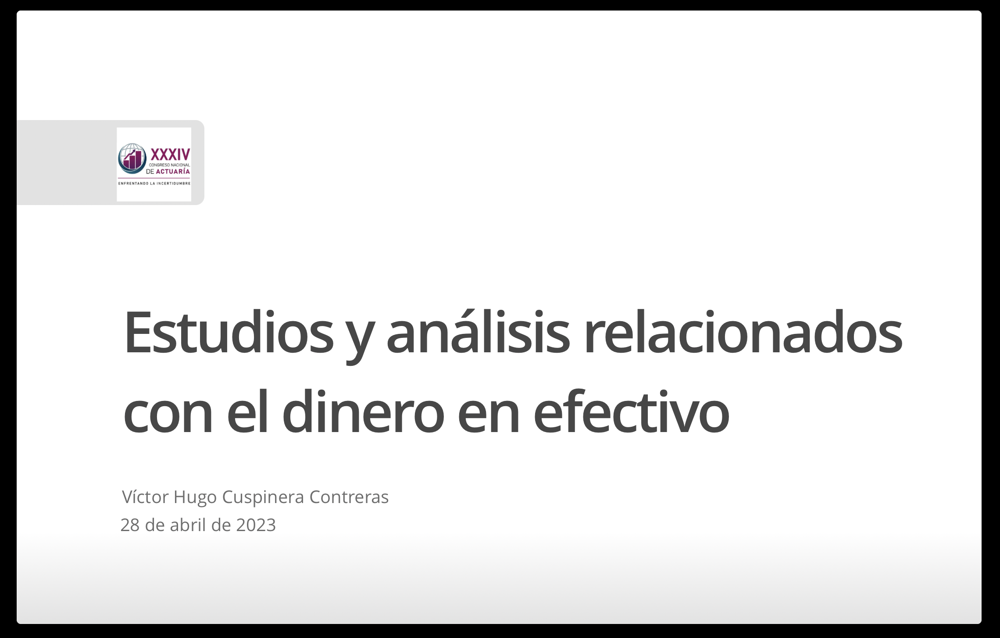
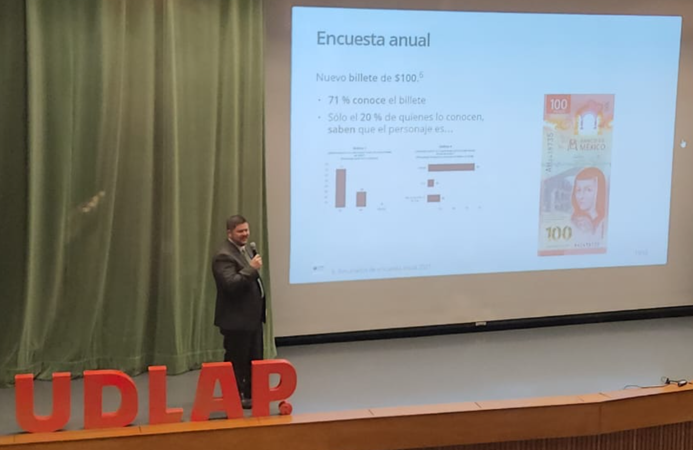
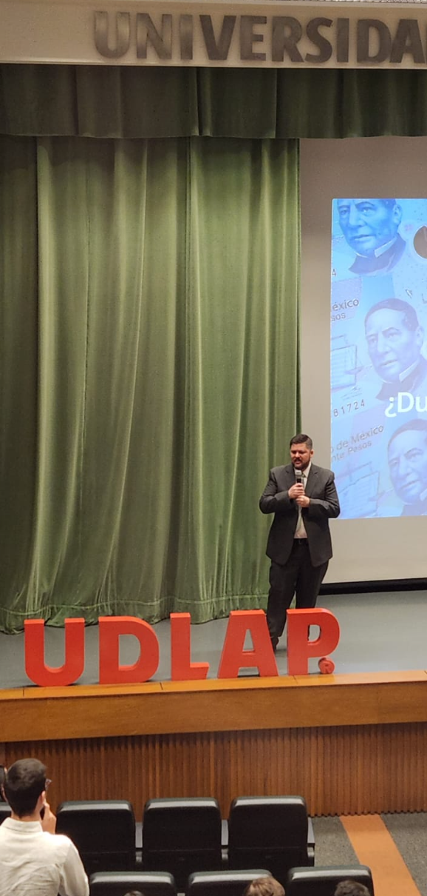

# Estudios y análisis relacionados con el dinero en efectivo

⚠️ *Note: the material of this repository would be shared mainly in Spanish.*

**Resumen**: Los **conocimientos y habilidades** de un **actuario** para analizar y resolver problemas lo hacen un profesionista muy **versátil**, que puede desarrollarse en diversas áreas de la industria, gobierno y empresas. En esta presentación comparto mi experiencia sobre estudios estudios cuantitativos y cualitativos realizados por el Banco de México relacionados con los billetes y monedas mexicanos. 

```diff
⚠ El contenido de este repositorio y presentación, así como las conclusiones que
  de ellas se derivan, son responsabilidad exclusiva del autor y no reflejan
  necesariamente las del Banco de México.
```

[](https://opensource.org/licenses/MIT)

## Autor

|Nombre |e-mail |GitHub user|  
|:----:|:----:|:-----:|  
|Víctor Hugo <br>Cuspinera Contreras | vcuspinera@gmail.com | [vcuspinera](https://github.com/vcuspinera) |  

## Presentación

### Liga de presentación

⭐️ La presentación se encuentra en [este link](https://vcuspinera.github.io/Cash_studies/Presentacion.html#1).

[](https://vcuspinera.github.io/Cash_studies/Presentacion.html#1)

### Fotogafías en congreso

<div class="columns-2">





</div>